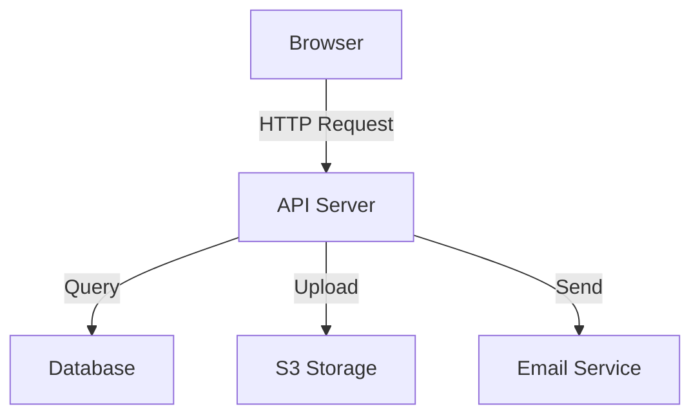

# Markdown Format Conventions

Complete conventions for building courses in markdown format. Read this when `$ARGUMENTS[1]` is `markdown`.

## Output Structure

```
course/
  README.md              # Course overview, table of contents, how to navigate
  01-what-it-does.md     # Module 1
  02-meet-the-actors.md  # Module 2
  03-how-they-talk.md    # Module 3
  ...
  glossary.md            # Complete glossary of all technical terms used
```

---

## Element Conventions

### Code <-> English Translations

Use paired code blocks with interleaved explanation. Always annotate with `file:line-range`.

````markdown
### What happens when you click "Submit"

```python
# app/routes.py:42-47
response = requests.post(api_url, json=payload, headers=auth_headers)
```

**In plain English:** This sends the user's data to the external API. `requests.post` means we're *sending* data (not just asking for it). The `json=payload` part converts our Python dictionary into the format the API expects. `auth_headers` includes our API key so the server knows we're authorized.
````

For longer snippets, interleave line-by-line:

````markdown
```python
# app/services/upload.py:15-22
def upload_file(file, user_id):
```
This function takes a file and the ID of the user uploading it.

```python
    validated = validate_file(file)
```
First, it checks the file is safe — right type, not too large, no malicious content.

```python
    url = s3_client.upload(validated)
    db.files.insert({"url": url, "owner": user_id})
    return url
```
Then it uploads to storage, saves a record in the database linking the file URL to the user, and returns the URL.
````

---

### Glossary Terms

Bold on first use with inline parenthetical definition. Also collect in `glossary.md`.

```markdown
The app uses a **webhook** (an automatic notification sent from one server to another when something happens — like a doorbell that rings when a package arrives) to notify the frontend when processing completes.
```

Rules:
- Define on first use per module
- Keep inline definitions to 1-2 sentences
- Include a metaphor when it helps
- Don't re-define in the same module — just bold the term on subsequent uses without the parenthetical

---

### Data Flow Walkthroughs

Use numbered steps with arrow notation showing source -> destination.

```markdown
### Data flow: User uploads a file

1. **Browser** — User selects file, JS reads it into memory
2. **Browser -> API** — `POST /api/upload` with file as multipart form data
3. **API -> Storage** — Server streams file to S3 bucket
4. **Storage -> API** — S3 returns the file URL
5. **API -> Database** — Server saves file metadata (URL, size, owner)
6. **API -> Browser** — Returns success with the file URL
7. **Browser** — UI updates to show the uploaded file
```

Rules:
- Each step is one discrete action
- Include the specific endpoint/method when known (e.g., `POST /api/upload`)
- Use `->` for direction, `<->` for bidirectional
- Bold the actor names for scannability

---

### Component Conversations

Use blockquote dialogue format. Give components personality — they're characters, not abstract boxes.

```markdown
### How login works (as a conversation)

> **Browser**: Hey API, here are the user's credentials.
> **API**: Let me check... *asks Database for the user record*
> **Database**: Found them. Here's their hashed password.
> **API**: *compares hashes* Match! Here's a session token, Browser.
> **Browser**: Thanks! I'll store this token and include it in every future request.
```

Rules:
- Each line is one message from one actor
- Use *italics* for internal actions (thinking, processing)
- Keep it conversational but technically accurate
- 5-10 messages per conversation — enough to show the full flow

---

### Architecture Diagrams

Use mermaid code blocks. Prefer `graph TD` (top-down) for hierarchical systems, `graph LR` (left-right) for pipelines.

````markdown

````

For simpler cases or when mermaid isn't available, use ASCII art:

```markdown
```
┌──────────┐    HTTP     ┌──────────┐    SQL     ┌──────────┐
│ Browser  │ ──────────> │   API    │ ────────> │ Database │
└──────────┘             └──────────┘            └──────────┘
                              │
                              │ Upload
                              v
                         ┌──────────┐
                         │    S3    │
                         └──────────┘
```
```

---

### Quizzes / Self-Assessment

Use collapsible `<details>` blocks. Present a scenario, then hide the answer.

```markdown
### Self-Assessment

**Scenario:** A user reports that uploaded files sometimes appear blank. Based on what you learned about the upload flow, where would you investigate first?

<details>
<summary>Think about it, then click to see the answer</summary>

The most likely failure point is between steps 2-3 (API -> Storage). If the stream to S3 is interrupted mid-transfer, the file object exists but is empty or corrupt. You'd check:
- API server logs for upload errors
- S3 bucket for zero-byte objects
- Network timeouts in the upload configuration

</details>
```

For multiple-choice style:

```markdown
**Scenario:** You want to add a "download as PDF" feature. Where would you add this logic?

- A) In the browser JavaScript
- B) As a new API route on the server
- C) In the database layer
- D) As a separate microservice

<details>
<summary>Answer</summary>

**B) As a new API route on the server.** PDF generation is CPU-intensive and needs server-side libraries. The browser would call this endpoint, the server generates the PDF, and sends it back as a download. You *could* do it client-side (A) for simple cases, but server-side gives you access to better PDF libraries and keeps the heavy work off the user's device.

</details>
```

Rules:
- 3-5 questions per module quiz
- Always explain *why* the answer is correct
- Wrong-answer explanations teach something, not just "wrong"
- Place at the end of each module after all content

---

### Callout Boxes

Use blockquotes with bold emoji-free labels.

```markdown
> **Key Insight:** This pattern — splitting responsibilities into focused roles — is one of the most important ideas in software engineering. Engineers call it "separation of concerns." Each component does one thing well and delegates everything else.
```

Variants:

```markdown
> **Key Insight:** For universal CS concepts and "aha!" moments

> **Good to Know:** For supplementary context that's useful but not critical

> **Watch Out:** For common mistakes, gotchas, and pitfalls
```

Max 2 callout boxes per module.

---

### File Trees

Use annotated code blocks with `#` comments for descriptions.

```markdown
```
app/
  routes.py        # API endpoints — where requests arrive
  models.py        # Database schemas — what data looks like
  services/
    upload.py      # File upload logic
    auth.py        # Authentication logic
  utils/
    helpers.py     # Shared utility functions
config/
  settings.py      # Environment variables and configuration
tests/
  test_upload.py   # Tests for the upload service
```
```

Rules:
- Show only the files that matter for the current module — not the entire tree
- Annotations should explain *what* the file does, not just its name
- Use indentation to show nesting

---

### Numbered Step Cards

For processes or build-up explanations, use bold numbered headers:

```markdown
### How the app starts up

**Step 1: Load configuration**
The server reads environment variables — database URL, API keys, port number. Think of it like a pilot going through a pre-flight checklist.

**Step 2: Connect to database**
It opens a connection to the database and verifies it can read/write. If this fails, the app refuses to start (better to fail loudly than serve broken responses).

**Step 3: Register routes**
Each URL pattern (`/api/users`, `/api/upload`, etc.) gets linked to the function that handles it. Like a phone switchboard connecting extensions to departments.

**Step 4: Start listening**
The server begins accepting requests on the configured port. It's now live.
```

---

## Module Structure

Each module file follows this template:

```markdown
# Module N: Title

> *One-sentence summary of what this module teaches*

## What You'll Learn

- Bullet point 1
- Bullet point 2
- Bullet point 3

---

## Section 1: Topic

[Content using the conventions above]

---

## Section 2: Topic

[Content]

---

## Self-Assessment

[Quiz using details blocks]

---

## What's Next

Brief teaser for the next module with a link: [Next: Module Title](./0N-next-module.md)
```

---

## Design Principles

- Each file should be readable standalone but link to related modules
- README.md provides a clear reading order with one-line module summaries
- Use horizontal rules (`---`) between major sections within a module
- Keep code blocks short (5-15 lines) with `file:line-range` annotations
- Use headers aggressively for scannability (H2 for sections, H3 for sub-topics)
- Glossary.md should be alphabetically ordered with cross-references to the module where each term is first used
- Prefer tables over bullet lists when comparing 3+ items with multiple attributes
- Use backtick formatting for all code references inline, even single function names
