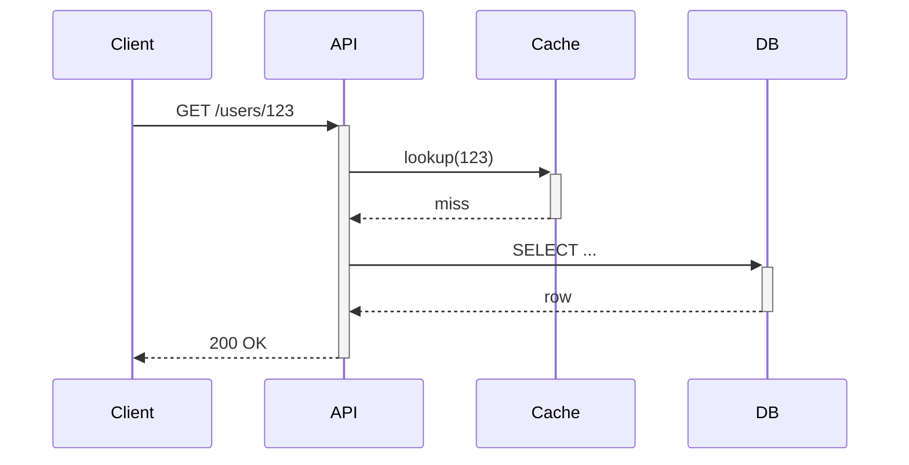

# Pull Requests

A PR description is a **permanent record**, not a disposable ticket.
The current reviewer reads it once; future engineers read it when they `git blame` a line of code years later trying to understand *why* a change was made. 
Write succinctly for both audiences.

The visible description should fit in **a single screen height**, read top to bottom without scrolling. 
Everything else (screenshots, test steps, logs, full rationale) goes into collapsed `<details>` blocks **if needed** which the reviewer can expand on demand.

## What the visible copy must answer

Study of real-world PRs shows human-written descriptions have a *median of 56 words* and reviewers do best on small, single-purpose changes (~200–400 lines).
Lead with brevity. 
The visible copy needs only:

- **Why** the change exists -- the motivation, linked issue, or user report.
  This is the part `git blame` readers come back for.
- **What** changed, in one or two sentences at a high level.

That's it.
Do **not**:

- Restate the diff.
  The diff is one click away and always more accurate than prose.
- Paste code-change diffs into the description. 
  Reviewers read the real diff in the Files tab.
- Enumerate every file or function touched. 
  If the change list is long, the PR is probably too big -- consider splitting it.

Aim for **roughly 50–150 words visible**.
A one-line fix may need a single sentence.
When you feel the urge to write more, that detail almost always belongs in a `<details>` block instead.

## Structure that stays scannable

- **Start with the text, not a heading.**
  The PR title is already the first heading -- open the body with a plain paragraph of *why + what*. 
  No `# Summary`, no heading of any kind before the first words.
- **Avoid sections.** 
  Most PRs need none.
  A single text block plus a couple of folded `<details>` is the target shape.
  Add a heading only when there is genuinely distinct content that earns one.
- **Never use generic section titles.** 
  `What` / `Why` / `How`, `Summary`, `Overview`, `Description`, `Changes` -- these carry no information.
  If a section is worth a heading, name it for its actual content (`Migration steps`, `Rollback`), otherwise drop the heading entirely.
- Keep prose in short lines; break reasoning or notable points into bullets.
- Fold anything optional (see below).

## Write in Simplified Technical English

Write the description in the spirit of Simplified Technical English -- short active sentences, plain consistent words, no jargon or filler. 
See the `simplified-technical-english` skill for the full rules.

## GitHub markdown features

Use GitHub's advanced markdown to keep the visible copy tight and push detail out of the way.

### 1. Collapsed sections — your main tool

Reference: <https://docs.github.com/en/get-started/writing-on-github/working-with-advanced-formatting/organizing-information-with-collapsed-sections>

This is how you keep the description to one screen.
Put **test steps, screenshots, logs, stack traces, and any extended rationale** behind `<details>` blocks. 
The content stays searchable and permanently archived, but the reviewer chooses when to see it.

```markdown
<details>
<summary>Test plan</summary>

- [x] Unit test covering the new timeout value
- [x] Manual: reproduced the original 504 on staging, confirmed fixed

</details>

<details>
<summary>Screenshots</summary>


</details>
```

Add `open` to start expanded: `<details open>`.
Leave one blank line after `<summary>` so nested markdown renders correctly.

### 2. Alerts (callouts)

Reference: <https://github.com/orgs/community/discussions/16925>

Highlight critical information so reviewers cannot miss it. 
Five types, case-sensitive, on their own line:

```markdown
> [!NOTE]
> General information the reader should notice.

> [!TIP]
> Optional guidance that makes the reviewer's life easier.

> [!IMPORTANT]
> Crucial for understanding or reviewing this change.

> [!WARNING]
> Demands immediate attention — breaking change, migration required, etc.

> [!CAUTION]
> Negative consequences possible — data loss risk, security implication.
```

Use sparingly, and only for something genuinely critical. 
Everything-is-important means nothing is.

### 3. Code blocks with syntax highlighting

Reference: <https://docs.github.com/en/get-started/writing-on-github/working-with-advanced-formatting/creating-and-highlighting-code-blocks>

Tag fenced blocks with a language identifier when you *do* need code -- a command to reproduce a bug, a config snippet, sample output. 
Not for restating the diff.

~~~markdown
```bash
$ cargo test --all
```
~~~

### 4. Diagrams

Reference: <https://docs.github.com/en/get-started/writing-on-github/working-with-advanced-formatting/creating-diagrams>

When the change touches control flow, data flow, or architecture, a small diagram can replace paragraphs -- but if it's large, fold it.
GitHub renders Mermaid, GeoJSON, TopoJSON, and ASCII STL from fenced code blocks. 
GitHub's UI is vertical and narrow, so prefer diagrams that are taller rather than wider.

~~~markdown

~~~

Prefer Mermaid over pasted screenshots of diagrams: it stays editable, diffable, and readable on mobile.

## Putting it together -- example

The entire thing above the fold is three short lines.
Everything else is one expand away.

```markdown
Fixes the 5-second auth timeout that caused intermittent 504s for users on
high-latency connections (see #4821). Raises the default request timeout to 30s.

> [!IMPORTANT]
> Downstream services relying on the old 5s timeout should review before merging.

<details>
<summary>Test plan</summary>

- [x] Unit test covering the new timeout value
- [x] Manual: reproduced the original 504 on staging, confirmed fixed

</details>

<details>
<summary>Repro logs (before fix)</summary>

```
2026-04-22T14:03:11Z ERROR upstream timeout after 5.01s
```

</details>
```

## Checklist before submitting

- [ ] Title is imperative and under ~70 chars
- [ ] Body opens with a plain text block, no heading before the first words
- [ ] No generic section titles (`What`/`Why`/`How`/`Summary`/`Changes`); ideally no sections at all
- [ ] Written in Simplified Technical English — short active sentences, consistent plain words
- [ ] Visible description fits in one screen height (~50–150 words)
- [ ] Reader can understand *why* without opening linked tickets
- [ ] No diff restated and no code-change diffs pasted into the description
- [ ] Screenshots, test steps, logs, and extended detail are behind `<details>`
- [ ] At most one alert, used only for a genuinely critical note
- [ ] Any code blocks have language tags
- [ ] Lines are **not** split
- [ ] A future reader doing `git blame` six months from now will have what they need
